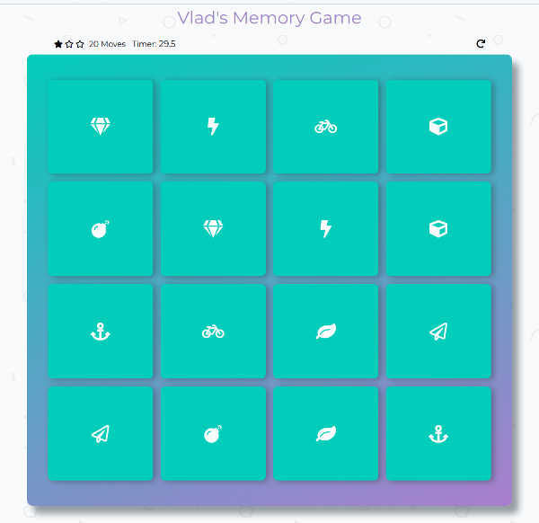

##### This project is forked from [**Udacity fend-project-memory-game**](https://github.com/udacity/fend-project-memory-game.git)

# Vlad's Memory Game

The game to test your memory.

## Table of Contents

* [Instructions](#instructions)

* [Game's Screenshots](#screenshots)

* [Contributing](#contributing)

* [Authors](#authors)

## Installing

No installation required. You need only web browser.

## Instructions

##### The rules are simple:

* 8 hidden pairs of cards are on the table
* The game starts by clicking on first card
* If two open cards are matched they stay opened
* If not, they close
* To win the game you need to open all pairs of cards
* If you'll click on the restart button the game will stop, cards will be reshuffled, counters will be reseted and you can start new game

## Game's screenshots

##### Start of the game

##### Two cards are matched

##### Game over

##### All cards are opened

## Contributing

Please read [CONTRIBUTING.md](CONTRIBUTING.md) for details on our code of conduct, and the process for submitting pull requests to us.

## Authors

* **Richard Kalehoff** _- initial work -_ [richardkalehoff](https://github.com/richardkalehoff)
* **Vlad Sivirin** _- some styles and JavaScript code -_ [vvs888](https://github.com/vvs888)
